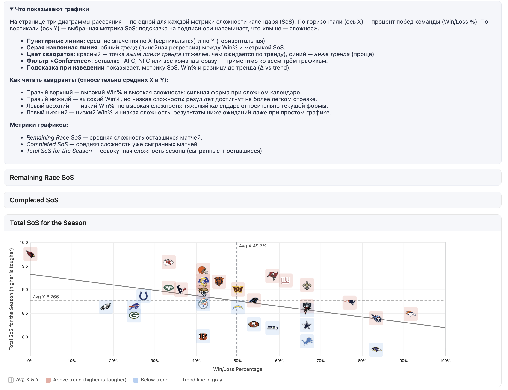
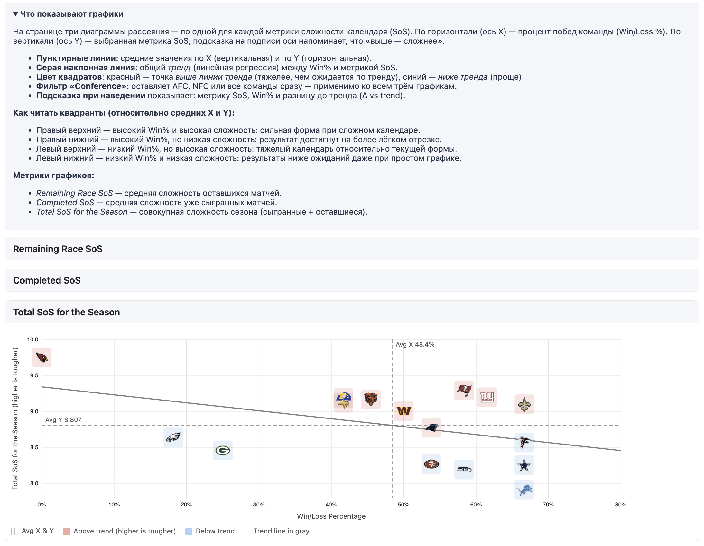

# 🏈 Разбор силы рассписания: Кто реально крут, а кто просто везунчик



## 📊 Сила расписания: Вся правда о "крутых" рекордах

Значит так, ребятки. Представте: один чувак заставил сопа ливнул с матча и получил победу, а другой пробил 10 ФГ на вип трибуну тк владелец команды мечтает быть ретернером. Из-за этого рекорды команд мало что значат, зато значит стата и ренкинги и на основе ее я решил посмотреть кто ебет, а кого ебут.

**Ravens** идут 10-2 и все охуевают от их рекорда. Но погоди-ка... их SOS сыгранных игр **0.43** - это самое лёгкое расписание во всём AFC! Общий показатель **7.73** вообще смешной. Они играли буквально с детьми весь сезон. Не говорю что они плохие, но их 10-2 сильно переоценен.

**Broncos** или Валера 4 паса с их 11-1 выглядят как монстры, да? Ну так вот, их общий SOS **8.49** - тоже один из самых мягких в конференции. Красивая циферка, но соперники были так себе (как и вся АФК)

**Patriots** с их 10-3 - это совсем другая история, друзья. Они рубились с реально сильными командами (SOS сыгранных игр **0.53**), и каждая их победа стоила пота и крови. Плюс впереди у них относительно лёгкий финиш (**0.46**) - могут реально выстрелить на 1 сид.

В NFC похожая движуха. 
**Lions** сидят на 8-4 с общим SOS **7.91** - это вообще самый лёгкий путь в конференции! Котики играли в песочнице. 

**Giants** с 8-5 имеют общий SOS **9.20** и реально заслужили каждую победу (кроме одной очевидной всем)

**Seahawks** с их 7-5 тоже смахивают на пузырь. SOS сыгранных игр **0.44** - они катали овощей. А теперь впереди жёсткий финиш (**0.58**) - вот тут и посмотрим на что они способны.

**Commanders** сидят на 6-6 и кажется что сезон провален. Но их SOS сыгранных игр **0.56** - один из самых жёстких. Они рубились как львы, просто соперники были сильные а жопа Маркуса слабой. А теперь фишка - впереди у них **0.46** финиш, легчайший среди претендентов! Это классическая тёмная лошадка, которая еще наведет шороха, запомните мои слова.


---

## 👨🏻‍🦼‍➡️ Гонка за плей-офф в AFC: Кто пройдёт, кто сольётся


### Топовая четвёрка (победители дивизионов)

**Broncos** (11-1) сейчас контролируют всё. У них 5 игр осталось, расписание сбалансированное (SOS буд 0.50). Выглядят стабильно, хотя я уже говорил - путь был лёгкий.

**Ravens** (10-2) все считают фаворитами, но я повторюсь - их рекорд раздут как пузырь. Играли с самыми слабыми в AFC (SOS сыгранных игр 0.43!), теперь будет чуть сложнее (0.52). Посмотрим выдержат ли.

**Titans** (10-2) - вот это реально стабильная банда. У них всё сбалансировано, ни лёгких подачек, ни безумных испытаний. Средний SOS весь сезон. Заслужили свои 10 побед.

А вот **Patriots** (10-3) - это мои фавориты по недооценке. Они играли с самыми сильными соперниками (SOS 0.53), и теперь впереди относительно лёгкий путь (0.46). При 10-3 и таких показателях они могут всех удивить и заскочить на первый сид.

### Борьба за Wild Card - тут начинается веселье

**Raiders** (8-4) выглядят почти гарантированным кандидатом на первый Wild Card. У них всё средненько - ни лёгкое, ни сложное расписание. Стабильность побеждает.

Но дальше начинается мясорубка. Есть целая толпа команд 6-6 и 5-7, и вот тут сила расписания решает всё.

**Chargers** (6-6) имеют впереди довольно лёгкий финиш (0.48). При их текущей форме они реально могут взять второй Wild Card если Мага таки осилит кик метр.

**Bengals** (5-7) - это тёмная лошадка за вайлдкард в AFC! У них впереди SOS **0.38** - это легчайший финиш среди всех! Плюс общий SOS всего 8.01. Если они сейчас поймают волну, могут нагнать всех.

**Steelers** (5-7) в жопе. Да, они 5-7, но проблема не в этом. Их SOS сыгранных игр был лёгкий (0.48), а теперь впереди один из самых жёстких финишей (0.58). Они катали слабаков, сосали, уволили Роджерса и камбекнули, но теперь начнётся настоящая проверка

**Browns** (5-7) тоже в гонке, но по другой причине. Их общий SOS **9.42** - самый тяжёлый среди всех претендентов в AFC.

**Chiefs** (4-8) технически ещё в гонке, особенно после волевой победы над Далласом на последних секундах овертайма через реадизацию 2 пт (ПЕС!!!) но давайте реалистично - у них общий SOS **9.58** плюс впереди кошмарный финиш (0.62). Нужно чудо библейского масштаба.

**Гонка за плей-офф AFC:**


```
Команда          Рекорд  SOS Буд.  SOS Прош.  Общий SOS  
Broncos *        11-1    0.50      0.50       8.49       
Ravens y         10-2    0.52      0.43       7.73       
Titans y         10-2    0.51      0.49       8.40       
Patriots y       10-3    0.46      0.53       8.73       
Raiders  x       8-4     0.49      0.52       8.65       
Chargers x       6-6     0.48      0.52       8.63       
Bengals  x       5-7     0.38      0.51       8.01       
Steelers         5-7     0.58      0.48       8.70       
Jaguars          5-7     0.53      0.53       8.95       
Browns           5-7     0.51      0.57       9.42       
Dolphins         5-7     0.51      0.52       8.75       
Texans           4-7     0.41      0.60       9.00       
Jets             4-8     0.51      0.54       9.04       
Chiefs           4-8     0.62      0.54       9.58       
```

**Обозначения:** * = первый сид | y = победители дивизионов | x = участники Wild Card


---

## 🔥 NFC - тут вообще дичь творится




### NFC North - Lions правят балом

**Lions** (8-4) контролируют дивизион, но я уже объяснял - их общий SOS 7.91 самый лёгкий в NFC. Впереди тоже мягко (0.45). Они хорошая команда, но не переоценивай их только из-за рекорда.

**Bears** (5-6) и **Vikings** (5-7) пытаются догнать, но у обоих тяжёлое расписание (общий SOS за 9.0). Шансы призрачные.

### NFC South - САМАЯ ГОРЯЧАЯ ГОНКА В ЛИГЕ!

Серьёзно ребята это кайф, тут все 4 команды реально могут выиграть дивизион, и сила расписания решает всё.

**Saints** (8-4) сейчас лидируют, но погоди радоваться - начался какой-то лузстрик. Впереди у них SOS **0.58** - это жесть. Они могут легко просрать лидерство в последние недели.

**Falcons** (8-4) тоже 8-4, но вот фишка - их финиш гораздо мягче (0.48)! По расписанию они в лучшей позиции чем Saints. Общий SOS тоже ниже (8.57 против 9.10). Я бы поставил на них в этой гонке.

**Buccaneers** (7-5) на одну победу отстают, но у них впереди **0.60** - это кошмарный финиш, тяжелейший в NFC! Они могут вообще вылететь не только из гонки за дивизион, но и из Wild Card. Критическая ситуация.

**Panthers** (7-6) вроде отстают больше всех, но не списывайте их раньше времени. У них средний финиш (0.57) и общий SOS 8.78 - не самый лёгкий, но и не убийственный. Если Saints и Bucs начнут сыпаться на своих тяжёлых расписаниях, Семен может вытрихнуть песок из старческой вагины и как дед тихо подкрасться и всех удивить. Дивизион ещё не решён!


### NFC East - борьба стариков

**Cowboys** (8-4) лидируют в дивизионе со средним расписанием - ничего особенного, просто стабильная работа и немного удачи. 

**Giants** (8-5) отстают на игру, но не дай себя обмануть этой циферкой. Их общий SOS **9.20** показывает что они реально сильная команда - просто играли с монстрами весь сезон. Каждая победа далась потом и кровью и сгоревшей жопой соперника. На последней неделе Гиганты с Ковсбоями могут решитьт исход дивизиона или даже первого сида

**Commanders** (6-6) - ещё одна тёмная лошадка! Они измотаны жёстким стартом (SOS 0.56), но впереди легчайший финиш (0.46). Классический сценарий для прорыва - тяжёлое испытание позади, лёгкая дорога впереди.

### NFC West - непонятная движуха

В West творится непонятная хуйня ребята. 

**Seahawks** (7-5) лидируют, но я уже говорил - их рекорд переоценен (лёгкое прошлое 0.44, жёсткий финиш 0.58). Они катали овощей, теперь начнётся мясорубка. Посмотрим что они из себя представляют на самом деле.

**49ers** (7-6) в похожей ситуации - тоже лёгкое прошлое (0.46), тоже жёсткий финиш (0.57). Пузырь может лопнуть в любой момент особенно если Кирилл опять будет не вовремя выходить с матча и сгорит от кик метра

**Rams** (5-7) вроде отстают прилично, но у них после тяжёлого старта (0.59) впереди лёгкий финиш (0.43) - могут выстрелить и замутить хаос в дивизионе.


### Wild Card в NFC - кто пройдёт?

**Giants** (8-5) или **Cowboys** (8-4) выглядят почти гарантированным Wild Card. 

Дальше жёсткая борьба между **Buccaneers, Seahawks, 49ers, Panthers** (все 7-5 или 7-6) и тёмной лошадкой **Commanders** (6-6).

Bucs под огромной угрозой из-за жёсткого финиша. Seahawks и 49ers переоценены. Commanders с их лёгким финишем могут всех удивить. Вот это будет шоу!

**Гонка за плей-офф NFC:**


```
Команда          Рекорд  SOS Буд.  SOS Прош.  Общий SOS
Lions   y        8-4     0.45      0.47       7.91
Saints  x        8-4     0.58      0.52       9.10
Falcons *        8-4     0.48      0.51       8.57
Cowboys x        8-4     0.52      0.47       8.26
Giants  y        8-5     0.50      0.55       9.20
Buccaneers       7-5     0.60      0.52       9.29
Seahawks  x      7-5     0.58      0.44       8.19
49ers   y        7-6     0.57      0.46       8.27
Panthers         7-6     0.57      0.50       8.78
Commanders       6-6     0.46      0.56       9.01
Bears            5-6     0.53      0.55       9.17
Vikings          5-7     0.54      0.54       9.12
Rams             5-7     0.43      0.59       9.19
```
**Обозначения:** * = первый сид | y = победители дивизионов | x = участники Wild Card

---


Вот такие дела малята, в AFC нас скорее всего ждет скука, а в NFC - нстоящее абсолют синима, в котором в ПО может не пройти любой из участников гонки. Осталось 5 недель и борьба будет до последнего!